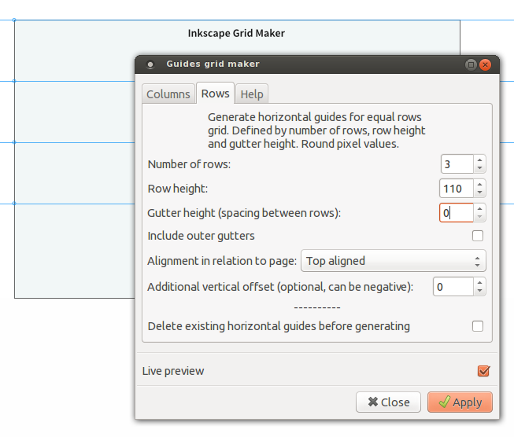

Inkscape grid maker
===================

This [Inkscape](http://inkscape.org/) extension (plugin) will generate a grid (guides actually) with **equal width columns (or rows) and gutters**.

> In graphic design, a **grid** is a structure (usually two-dimensional) made up of a series of intersecting straight (vertical, horizontal, and angular) or curved guide lines used to structure content. The grid serves as an armature on which a designer can organize graphic elements (images, glyphs, paragraphs) in a rational, easy to absorb manner. - from [Wikipedia](http://en.wikipedia.org/wiki/Grid_%28graphic_design%29)

This extension was originally conceived as a tool for grids in designing websites in Inkscape. The guides are therefore positioned using pixels, and use rounded numbers (they are set on the pixel). Not tested with other units.

It is an alternative to positioning guides manually, or positioning paths and converting them to guides, or using the Grids in the Document Properties.

Example 1: Columns (vertical guides), with gutters, centered on the document

Example 2: Rows (horizontal guides), gutters set to 0, top aligned

### Features

With this extension, you can...
- create **columns** with gutters (vertical guides), and **rows** with gutters (horizontal guides);
- **define the number of columns, the column width and gutter width** to generate a grid; same with rows;
- set the gutter width to zero to have evenly spaced guides without gutters;
- choose to align the grid in relation to the page: left aligned, centered or right aligned;
- optionnally add an extra horizontal/vertical offset, for example to generate the grid at a certain distance from the page border (when left/right aligned); this offset can be negative; for columns, this offset is a shift to the right (when positive), for rows it is a shift down (when positive)
- optionnally delete all existing horizontal/vertical guides before generating the new guides;
- see a preview using Live preview, to test different widths.

### How to install the extension

1. Download zip archive from current site (github) to your computer;
2. Unzip (extract) the archive on your computer;
3. Open it. In the folder grid-maker-extension, you wil find two files: **grid_maker.inx** and **grid_maker.py**. Copy these two files into your Inkscape extensions folder:

- on Windows: "C:\Program Files\Inkscape\share\extensions"
- on Linux: " /home/yourusername/.config/inkscape/extensions" (.config is a hidden folder)
- on OS X: "/Applications/Inkscape.app/Contents/Resources/extensions" 

Restart or open Inkscape.

### Usage

You will find the Guides Grid Maker under menu **Extensions > Render > Guides grid maker**.

Change the settings, click Apply. Close, done.

Or change the settings, select Live Preview, adjust, **click Apply** to actually generate the guides. Close, done.

### Tips

- You can generate **multiple grids** on top of each other, by using applying grids several times. Just be sure to uncheck "*Delete existing guides*". 
- Need guides in the middle of your gutters? After generating the columns (with gutters set to *even* number), generate a new grid with gutters set to zero, column width set to [original column width + gutter width]. 
- You can position several generated **grids side by side** using a very large offset.
- Need a **baseline grid** in addition to the generated columns ? Use Inkscape's grids under File > Document Properties > Grids. Set a new rectangular grid with for example Spacing X = 2000, Spacing Y = 14.

### Other grid related tools for web design

Online grid generators and previewers - I sometimes use them to get the right widths *before* using my extension: 

- [grid calculator](http://www.29digital.net/grid/)
- [variable grid system](http://grids.heroku.com/) - can actually generate css classes, just input the same numbers you used for designing your grid (fluid and fixed grid)
- [grid calculator and generator](Grid calculator and generator) - set a fixed total width, give a range of column/gutter width, get possible combinations

The Grid Maker extension generates guides, helpful for example in *designing* websites. However, it does *not* create the css - you will have to do that yourself. Some ready made tools and frameworks that can help with grid based websites (in addition to learning css!): [variable grid system](http://grids.heroku.com/), [bootstrap](http://getbootstrap.com/), [foundation](http://foundation.zurb.com/), [susy](http://susy.oddbird.net/)  , and [many others](css grid framework)... or build your own...

### To do (no promises...) and ideas

- ~~when gutter set to zero, there should be single guides, not double guides (rewrite the function);~~ Done
- ~~Delete only horizontal/vertical guides, not all guides~~ Done
- ~~allow the choice to exclude the outer gutters/guides;~~ Done
- Align grid in relation to a selected bounding box, instead of the whole page ?
- ~~Show offset option only when choosing Alignment with offset (or find better solution)~~ Offset is now available to all alignments
- Outside in: Ability to set total width, or use page margins to set grid width ? And then set gutter width, with generated column width (no rounded pixels...)
- other units than pixels ? Milimeters ? (see other Grid Creator extension...) Should the guide be allowed to be on non-rounded positions ? (maybe for print ?)
- ~~Show total width when changing settings, calculated live.~~ I don't think that's possible in the interface.
- Add other guides related extensions (generate with offset to page border, generate center guides, delete only horizontal/vertical guides,...), add Grid Maker together with these extensions in Extensions > Guides (instead of Render)
- Make multi-lingual
- Make written tutorial with images, make a screencast...

### Thank you

Thanks to the creator of the [Inkscape Guides Creator](http://code.google.com/p/inkscape-guides-creator/), the extension which I used as a base for this one. Most of the work was already done, I just adapted it to my needs.

### Licence

Licence of the plugin : GPL v2, just like Inkscape  
Author: [Samuel Dellicour](http://www.samplify.be)