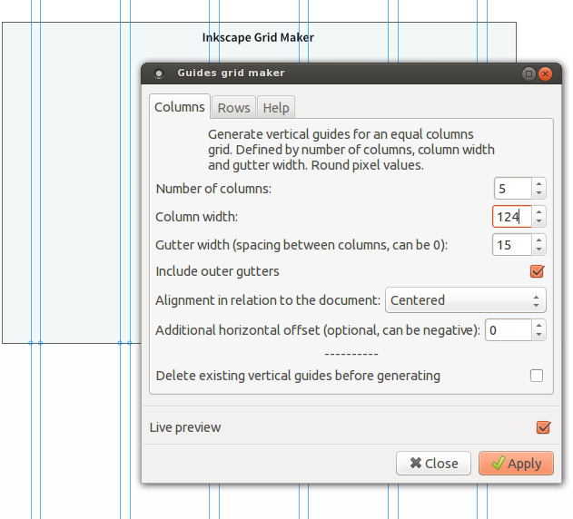

Inkscape grid maker
===================

This [Inkscape](http://inkscape.org/) extension (plugin) will generate a grid (guides) with **equal width columns and gutters**, or rows and gutters.

> In graphic design, a **grid** is a structure (usually two-dimensional) made up of a series of intersecting straight (vertical, horizontal, and angular) or curved guide lines used to structure content. The grid serves as an armature on which a designer can organize graphic elements (images, glyphs, paragraphs) in a rational, easy to absorb manner. - [Wikipedia](http://en.wikipedia.org/wiki/Grid_%28graphic_design%29)

It was conceived as a tool for grids in designing websites in Inkscape. The guides are therefore positioned using pixels, and use rounded numbers (they are set on the pixel). Not tested with other units.

It is an alternative to positioning paths and converting them to guides, or to using the Grids in the Document Properties, or to position guides manually.

Example:

### Features

- Define number of columns, column width and gutter width to generate a grid;
- Gutter width can be set to zero;
- Choose to align the grid in relation to the page: left aligned, centered or right aligned;
- On top of this alignment, you can set an offset from to the right (for columns), or down (for rows); this offset can be negative;
- Can also generate rows with gutters (and offset);
- Option to delete all existing guides before generating the new guides
- Live preview to test different widths

### How to install the extension

1. Download zip archive from current site (github) to your computer;
2. Unzip (extract) the archive on your computer;
3. Open it. In the folder grid-maker-extension, you wil find two files: **grid_maker.inx** and **grid_maker.py**. Copy these two files into your Inkscape extensions folder:

- on Windows: "C:\Program Files\Inkscape\share\extensions"
- on Linux: " ~/.config/inkscape/extensions" (where "~" is /home/yourusername/)
- on OS X: "/Applications/Inkscape.app/Contents/Resources/extensions" 

Restart or open Inkscape.

### Usage

You will find the Guides Grid Maker under menu **Extensions > Render > Guides grid maker**. (so *not* Guides creator, and *not* Grid).

Change the settings, click Apply. Close, done.

Or change the settings, show Live Preview of the changes, adjust, click Apply. Close, done.

That's it.

### Tips

- You can generate multiple grids, just be sure to uncheck "*Delete existing guides*". 
- Need guides in the middle of your gutters? After generating the columns, generate a new grid with gutters set to zero, column width set to [original column width + gutter width].
- You can position several grids side by side (for side by side web pages for example), using a very large offset, without changing your document.
- No need for these outer gutters/guides? Just delete them manually.
- Need a *baseline grid* in addition to the generated columns ? Instead of using this extension, use Inkscape's grids under File > Document Properties > Grids. Set a new rectangular grid with for example Spacing X = 2000, Spacing Y = 14.

### Other grid related tools for web design

Online grid generators and previewers - I sometimes use them to get the right widths *before* using my extension: 

- [grid calculator](http://www.29digital.net/grid/)
- [variable grid system](http://grids.heroku.com/) - can actually generate css classes, just input the same numbers you used for designing your grid (fluid and fixed grid)
- [grid calculator and generator](Grid calculator and generator) - set a fixed total width, give a range of column/gutter width, get possible combinations

The Grid Maker extension generates guides, helpful for example in *designing* websites. However, it does *not* create the css - you will have to do that yourself. Some ready made tools and frameworks that can help with grid based websites (in addition to learning css!): [variable grid system](http://grids.heroku.com/), [bootstrap](http://getbootstrap.com/), [foundation](http://foundation.zurb.com/), [susy](http://susy.oddbird.net/)  , and [many others](css grid framework)... or build your own...

### To do (no promises...)

- when gutter set to zero, there should be single guides, not double guides;
- allow the choice to exclude the outer gutters/guides;
- Align grid in relation to a selected bounding box, instead of the whole page ?
- Show total width when changing settings, if possible.
- ~~Show offset option only when choosing Alignment with offset (or find better solution)~~ Offset is now available to all alignments
- Option to add guide in the middle of each gutter (if gutter width is even number...) - for now, you can add center gutters separately by generating a new grid
- Ability to set total width ? And set gutter width, with automatic column width (no rounded pixels...)
- other units than pixels ? Milimeters ? (see other Grid Creator extension...) Should the guide be allowed to be on non-rounded positions ? (maybe for print ?)

### Thank you

Thanks to the creator of the [Inkscape Guides Creator](http://code.google.com/p/inkscape-guides-creator/), the extension which I used as a base for this one. Most of the work was already done, I just adapted it to my needs.

### Licence

Licence of the plugin : GPL v2, just like Inkscape

Author: Samuel Dellicour